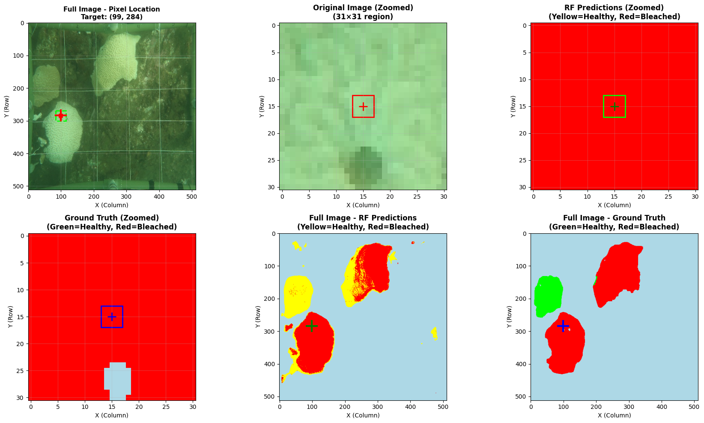
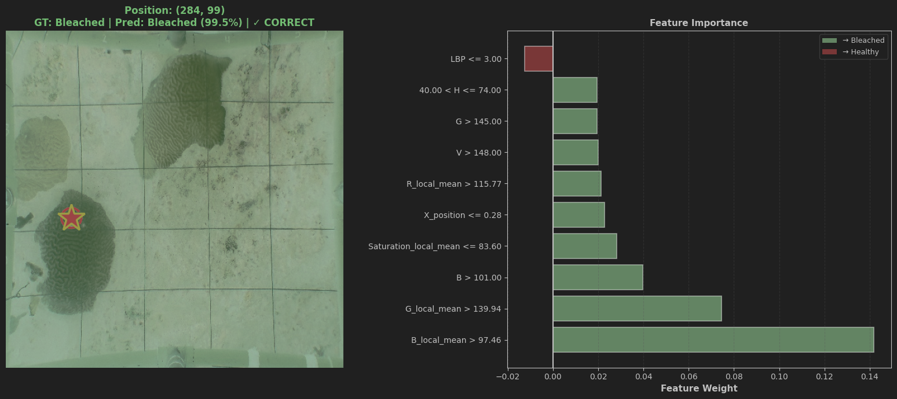

# Coral Bleaching Classification using Random Forest and LIME

## 1. Introduction and Overview

This step provides a machine learning pipeline for automated classification of coral bleaching in underwater imagery at the pixel level. 

**Key Features:**
- Two-stage pipeline combining segmentation and classification
- Pixel-level analysis for detailed coral health assessment
- Explainable AI using LIME for interpretable predictions
- Comprehensive validation metrics and visualizations
- LLM integration for natural language explanations

## 2. Installation Instructions

**System Requirements:**
- Python 3.7 or higher

**Installation Steps:**

1. Create a virtual environment (recommended):
```bash
python -m venv venv
source venv/bin/activate  # On Windows: venv\Scripts\activate
```

2. Install dependencies:
```bash
pip install -r requirements.txt
```

**Dataset Setup:**
Place your coral images and masks in the following structure:
```
datasets/
├── coral_dataset_resize/
   ├── images/
   ├── masks_bleached/
   └── masks_non_bleached/
```

## 3. Usage and Examples

### Basic Workflow

**Step 1: Prepare Dataset**
Run the image resizing section to standardize your dataset to 512×512 pixels. The validation images are segmented using the pre-trained EfficientNet model:
```bash
python ../EfficientNet+Carbon_tracking+Comparison/val_segmentation_output.py 
```
For details, refer to: `EfficientNet+Carbon_tracking+Comparison/val_segmentation_outputs/readme.md`

**Step 2: Train the Model**
Execute the training cells to extract features and train the Random Forest classifier. The model will be saved as `coral_bleaching_random_forest.pkl`.

**Step 3: Validate on Test Set**
Run the validation loop to process all validation images and generate aggregate metrics.

**Step 4: Analyze Single Images**
Use the single image analysis section to visualize predictions for specific images with detailed breakdowns.

**Step 5: Inspect Specific Pixels**
Specify pixel coordinates (x, y) to examine individual predictions with LIME explanations.

### Example Usage

**Analyzing a pixel in a Single Image:**
The analysis generates visualization outputs:


*Prediction visualization with comparison to ground truth*


*LIME explanation showing feature importance for the prediction*

## 4. Troubleshooting and FAQs

**Q: "Could not read image" error**
- Ensure image paths are correct and files exist
- Check that images are in JPG/PNG format
- Verify file permissions

**Q: Model predictions are all one class**
- Check class balancing during training
- Verify ground truth masks are properly labeled
- Ensure segmentation masks are correctly loaded

**Q: Out of memory errors**
- Reduce `sample_ratio` parameter (default: 1.0)
- Process fewer images at once
- Use `max_images` parameter to limit dataset size

**Q: Low accuracy on validation set**
- Check if segmentation quality is poor (many missed coral regions)
- Verify ground truth masks are accurate
- Consider adjusting Random Forest hyperparameters

**Known Issues:**
- Feature extraction can be memory-intensive for very large images
- LLM explanations require internet connection and valid API key
- Processing time scales linearly with number of coral pixels

## 5. Credits and Acknowledgements

**Libraries and Tools:**
- [scikit-learn](https://scikit-learn.org/) - Random Forest classifier
- [scikit-image](https://scikit-image.org/) - Local Binary Pattern texture analysis
- [OpenCV](https://opencv.org/) - Image processing
- [LIME](https://github.com/marcotcr/lime) - Model interpretability
- [Groq API](https://groq.com/) - LLM integration for natural language explanations

**References:**
- Local Interpretable Model-agnostic Explanations (LIME): Ribeiro et al., 2016
- Random Forest: Breiman, 2001